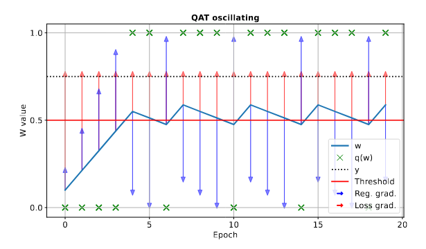

## Official Source Code for OsciQuant
This repository contains the official implementation of **Oscillations Make Neural Networks Robust to Quantization**.

For a detailed explanation of the methodology and results, refer to our paper: [**OsciQuant: Quantization-Aware Training with Regularization**](https://arxiv.org/abs/XXXX.XXXXX)

The source code will be updated with experiments after the paper completes peer-review.

<!--
## Installation
```bash
pip install osciquant
```
-->

## Usage

#### Importing OsciQuant

```python
from osciquant.regularization import OsciQuantLoss
from osciquant.quantizers import UniformQuantizer
from osciquant.handler import attach_weight_quantizers, toggle_quantization
```

#### Attaching Quantizers
```python
attach_weight_quantizers(model=model, 
                         exclude_layers=[], 
                         quantizer=UniformQuantizer(bit_width), 
                         enabled=False)
```
Attaches quantizers to the specified layers of the model. The weights in these layers will be regularized. When `quantized_eval` is set to `True`, the quantized weights are used during the forward pass. `toggle_quantization` changes the state of enabled.
 

#### Training with Regularized Loss
```python
regularized_loss = OsciQuantLoss(base_loss=criterion, 
                                 model=model,
                                 regularization_lambda=1, 
                                 regularization=True)
```
The `OsciQuantLoss` function introduces a regularization term that induces oscillations, making the weights robust to quantization. To validate the model with quantized weights, use `toggle_quantization` before evaluating.


```python
for i in epochs:
    toggle_quantization(model, enabled=False)
    ...
    train_loss = regularized_loss(pred_train, y_train)
    ...
    toggle_quantization(model, enabled=True)
    ...
    quantized_val_loss = criterion(pred_val, y_val)
```

---
## Todo
- feature: function for adding unique quantizer object to each layer (LSQ)
- feature: function for cross-bit accuracy
- bug: If layer is not used in forward, it is still regularized if it has a quantizer attached

---

## Citation
Kindly use the following BibTeX entry if you use the code in your work.
```
@article{wenshøj2025osciquant,
    title={Oscillations Make Neural Networks Robust to Quantization},
    author={Jonathan Wenshøj and Bob Pepin and Raghavendra Selvan}
    journal={Arxiv},
    year={2025}}
```
